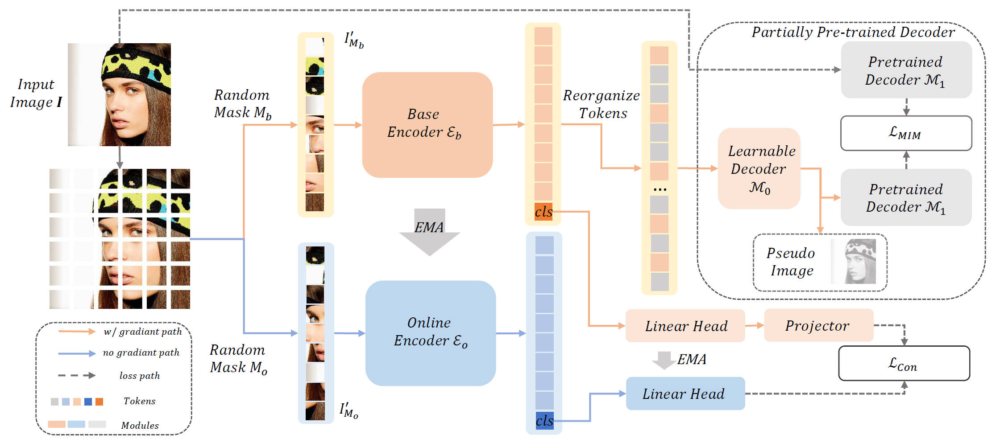

# Toward High Quality Facial Representation Learning (ACM MM 2023)

<!-- <br> -->
[Yue Wang](https://github.com/nomewang), 
[Jinlong Peng](https://pjl1995.github.io/),
Jiangning Zhang,
[Ran Yi](https://yiranran.github.io/), 
[Liang Liu](https://scholar.google.com/citations?hl=zh-CN&user=Kkg3IPMAAAAJ), 
[Yabiao Wang](https://scholar.google.com/citations?hl=zh-CN&user=xiK4nFUAAAAJ), 
[Chengjie Wang](https://scholar.google.com/citations?hl=zh-CN&user=fqte5H4AAAAJ), 
<!-- <br> -->



## Abstract
> Face analysis tasks have a wide range of applications, but the universal facial representation has only been explored in a few works. In this paper, we explore high-performance pre-training methods to boost the face analysis tasks such as face alignment and face parsing. We propose a self-supervised pre-training framework, called **Mask Contrastive Face (MCF)**, with mask image modeling and a contrastive strategy specially adjusted for face domain tasks. To improve the facial representation quality, we use feature map of a pre-trained visual backbone as a supervision item and use a partially pre-trained decoder for mask image modeling. To handle the face identity during the pre-training stage, we further use random masks to build contrastive learning pairs. We conduct the pre-training on the LAION-FACE-cropped dataset, a variants of LAION-FACE 20M, which contains more than 20 million face images from Internet websites. For efficiency pre-training, we explore our framework pre-training performance on a small part of LAION-FACE-cropped and verify the superiority with different pre-training settings. Our model pre-trained with the full pre-training dataset outperforms the state-of-the-art methods on multiple downstream tasks. Our model achieves 0.932 NME$_{diag}$ for AFLW-19 face alignment and 93.96 F1 score for LaPa face parsing.


### [Paper](https://arxiv.org/abs/2309.03575)


## Todo (Latest update: 2023/10/30)
- [x] **Release the testing code

## Pre-trained Checkpoint

| Model | URL |
| - | - |
| ViT-B/16 16 epochs| [drive](https://drive.google.com/file/d/1hZqMKUfc2J6zGMDLPB4m32fIzi0TSecU/view?usp=sharing) |

## Install package

``` bash
pytorch==1.8.2
timm==0.3.2
```

## Training

``` bash
# folder dataset
OMP_NUM_THREADS=1 python3 -m torch.distributed.launch --nproc_per_node=8 main_pretrain.py \
    --batch_size 64 \
    --accum_iter 8 \
    --model mae_vit_base_patch16     \
    --input_size 224 \
    --mask_ratio 0.75     \
    --epochs 16     \
    --warmup_epochs 1     \
    --blr 1.5e-4 \
    --weight_decay 0.05 \
    --moco_m 0.99 \
    --cpl_ckpt  CKPT \
    --data_path  DATA_PATH \
    --log_dir  LOG_DIR \
    --output_dir OUTPUT_DIR
```

```bash
# lmdb dataset
OMP_NUM_THREADS=1 python3 -m torch.distributed.launch --nproc_per_node=8 main_pretrain.py \
    --batch_size 64 \
    --accum_iter 8 \
    --model mae_vit_base_patch16     \
    --input_size 224 \
    --mask_ratio 0.75     \
    --epochs 16     \
    --warmup_epochs 1     \
    --blr 1.5e-4 \
    --weight_decay 0.05 \
    --moco_m 0.99 \
    --use_lmdb_dataset \
    --lmdb_txt LMDB_DATASET \
    --cpl_ckpt  CKPT \
    --data_path  DATA_PATH \
    --log_dir  LOG_DIR \
    --output_dir OUTPUT_DIR
```

## Citation
If you find this code helpful for your research, please cite:
```
@article{wang2023toward,
  title={Toward High Quality Facial Representation Learning},
  author={Wang, Yue and Peng, Jinlong and Zhang, Jiangning and Yi, Ran and Liu, Liang and Wang, Yabiao and Wang, Chengjie},
  booktitle={Proceedings of the 30th ACM International Conference on Multimedia},
  year={2023}
}
```

